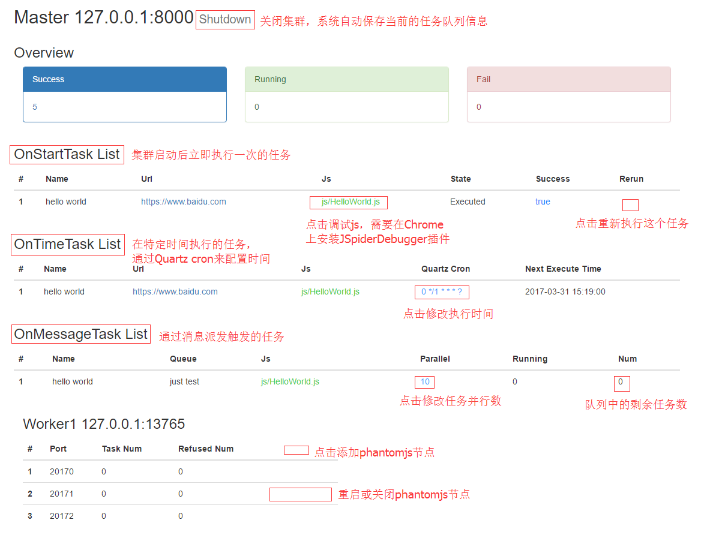
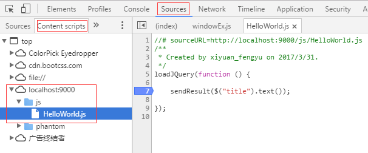

## JSpiderCluster  

Java + phantomjs 实现的一个分布式爬虫。  
java部分主要进行集群的管理，任务队列的管理和任务分发，支持jar和class热发布。  
phantomjs执行实际的抓取任务，抓取逻辑采用js编写，可以方便的导入jquery，
使用jquery可以很方便地从网页中提取需要的信息，在抓取逻辑的js中可以使用一些扩展功能，例如下载，截图，导入js。

#### 快速起步
1. 安装phantomjs，并配置环境变量  
2. 从[这里](https://github.com/xiyuan-fengyu/JSpider_HelloWorld)下载Hello World示例  
3. 用IDE打开示例项目，将libs目录下的JSpiderCluster.jar添加为依赖  
4. 运行com.xiyuan.helloworld.Luncher，可以在控制台最后看到 https://www.baidu.com 网页的title"百度一下，你就知道"
5. 在浏览器中打开 http://localhost:9000/ 可以看到当前爬虫的工作情况，整个界面的功能将在后续做详细介绍  

#### 管理界面的功能介绍

1. 集群关闭    
鼠标移动到Master的地址后面会出现shutdown按钮，
点击弹出确认面板，确认后会停止集群，
并显示关闭过程的信息，系统会自动将集群的任务信息保存到cache/queueMap.cache文件中，
下一次启动的时候，系统会自动加载这个文件并恢复之前的任务信息。
可以手动删除这个文件来避免加载之前的任务信息，通过脚本或者命令直接杀死进程则不会保存任务信息。

2. js调试功能  
从[这里](https://github.com/xiyuan-fengyu/JSpiderDebugger)下载调试插件，仅适用于Chrome浏览器。
在Chrome的扩展程序页面 chrome://extensions/ 点击 “加载已解压的扩展程序”安装插件。
在管理界面点击js弹出debug信息确认面板，如果是OnMessageTask类型的任务且队列里没有任务，则url需要自行填写；
点击debug后，会自动打开一个新的tab页并跳转到目标url，然后执行js；按F12打开 开发者面板，定位到要调试的js，
添加断点，然后刷新就可以调试了。


3. Quartz Cron表达式不会写怎么办？  
可以参考[这里](http://cron.qqe2.com/)

#### 例子

#### 如何部署

#### FAQ  
1. Linux中用phantomjs对中文网页截图，可能会出现中文乱码或者不显示中文的问题  
http://www.oicqzone.com/pc/2014091419765.html  
http://www.cnmiss.cn/?p=436  
解决办法就是安装字体。  
在centos中执行：  
```yum install bitmap-fonts bitmap-fonts-cjk```  
在ubuntu中执行：  
```sudo apt-get install xfonts-wqy```  
这样再去截图中文的页面就不会出现一堆的方框了。  


2. 下载功能必须将config/phantom.json中page的webSecurityEnabled属性设置为false